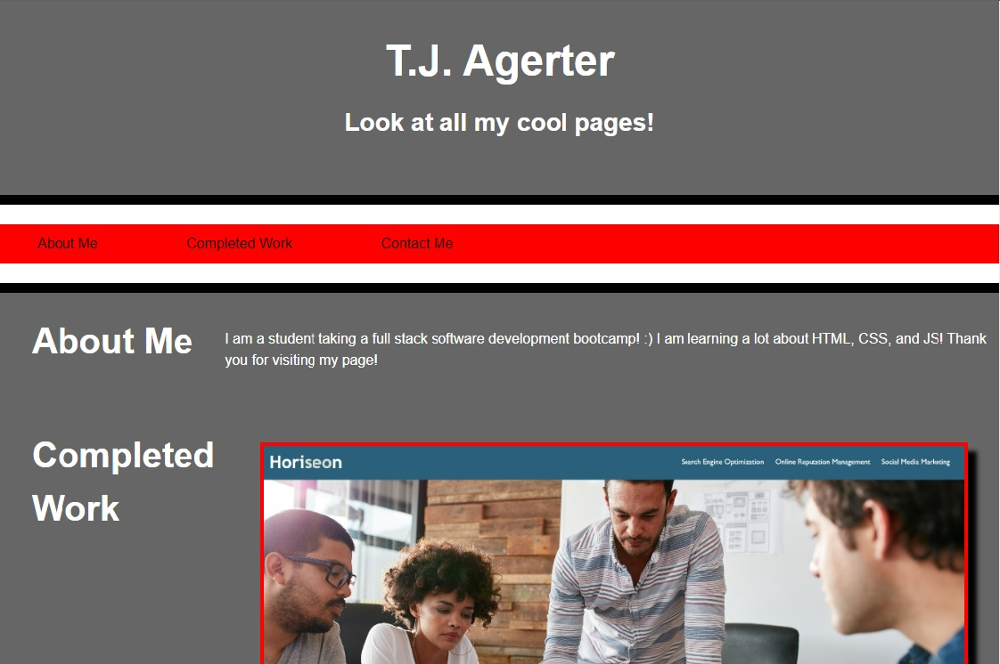

# Portfolio Mockup for Advanced CSS Homework

## DESCRIPTION

This is a mockup portfolio created for the second week of bootcamp, Advanced CSS. It  was created to aid my understanding not only of CSS, but also HTML and Git. Through this project I gained experience in creating a functional portfoio within HTML and CSS.
The instructions for this project can be found at [INSTRUCTIONS](./assets/INSTRUCTIONS.md)

## USAGE

The website is split into three sections:

- About me: An introduction to myself, and my available skills.
- Completed Works: Links to each webpage with screenshots and description.
- Contact Me: Links to my github page and email address.

## Features

- Name and photo
- Navigation bar links to each section
- Visual links to each completed work with the first being larger than the rest
- Layout adaptive to window width

## SCREENSHOT

## LICENSE

Licensed under MIT License, see LICENSE for details.

## ACKNOWLEDGEMENTS

The CSS was primarily built from assignments done in the second week of bootcamp, "Advanced CSS."